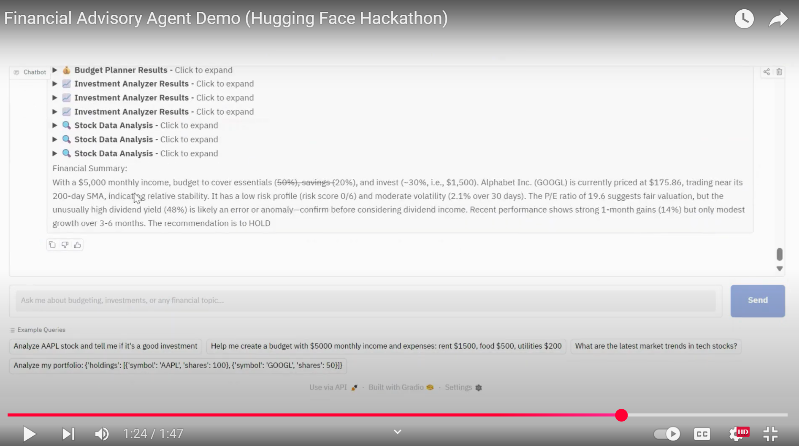

# AI Financial Advisory Agent

An intelligent financial advisory agent powered by OpenAI's GPT-4.1 and specialized financial tools. This agent provides comprehensive financial analysis, investment recommendations, budget planning, and market insights through an intuitive web interface with **advanced natural language processing**.

**Watch the demo video:** [Financial Advisory Agent Demo (Hugging Face Hackathon)](https://youtu.be/vGOSAXyrQgM)


[](https://youtu.be/vGOSAXyrQgM)

## 🚀 Features

### Core Financial Tools
- **📊 Investment Analyzer**: Analyze ANY stock using natural language - "Tell me about NVIDIA" or "How is Tesla doing?"
- **💰 Budget Planner**: Create budgets from conversational input - "I make 6k monthly, rent is 1800, food 600"
- **📈 Portfolio Analyzer**: Analyze portfolios from natural descriptions - "My portfolio: Apple 100 shares, Google 50 shares"
- **📰 Market Trends Analyzer**: Get optimized market research from simple queries - "What's happening in tech?"

### Advanced Features
- **🧠 OpenAI Function Calling**: All tools use intelligent input extraction from natural language
- **🎯 Smart Response Type Detection**: Automatically detects if users want short summaries or detailed reports
- **⚡ Real-time LLM Streaming**: Live token-by-token response generation from OpenAI API
- **📋 Interactive Tool Results**: Collapsible sections for clean data presentation
- **🔍 Comprehensive Data Analysis**: Enhanced insights for all financial data
- **🌐 Universal Stock Support**: Supports analysis of ANY publicly traded stock, not just predefined ones

## 🛠️ Installation

1. **Clone the repository**
```bash
git clone https://huggingface.co/spaces/Agents-MCP-Hackathon/Financial-Advisory-Agent.git
cd Financial-Advisory-Agent
```

2. **Install dependencies**
```bash
pip install -r requirements.txt
```

3. **Set up environment variables**
Set environment variables:
```bash
export OPENAI_API_KEY="your-openai-api-key"
export TAVILY_API_KEY="your-tavily-api-key"
```

4. **Run the application**
```bash
python app.py
```

## 🎯 Response Types

The system automatically detects your preference:

### Short Response Keywords
- `quick`, `brief`, `short`, `summary`, `concise`, `simple`, `fast`, `tldr`, `bottom line`

### Detailed Response Keywords  
- `detailed`, `comprehensive`, `thorough`, `in-depth`, `report`, `breakdown`, `explain`, `elaborate`, `deep dive`

### Default Behavior
- **Short responses** are the default (under 200 words)
- **Detailed responses** are triggered by specific keywords (comprehensive analysis)

## 🔧 Technical Architecture

- **Frontend**: Gradio web interface with real-time streaming
- **Backend**: LangChain agents with OpenAI GPT-4.1
- **AI Integration**: OpenAI function calling for intelligent input processing across all tools
- **Data Sources**: 
  - Yahoo Finance API for stock data (supports ALL publicly traded stocks)
  - Tavily Search API for market news
  - Real-time financial calculations
- **Streaming**: Direct LLM token streaming from OpenAI API
- **Tools**: Specialized financial analysis functions with natural language processing

## 📊 Tool Capabilities

### Investment Analyzer 🧠
- **Natural Language Input**: "Tell me about NVIDIA", "How is Tesla doing?", "Analyze AMZN"
- **Universal Stock Support**: Works with ANY publicly traded stock symbol
- **OpenAI-Powered Extraction**: Intelligently extracts stock symbols from company names
- Real-time stock prices and historical data
- Technical indicators (RSI, MACD, Bollinger Bands, Moving Averages)
- Risk assessment (volatility, VaR, beta analysis)
- Fundamental analysis (P/E, P/B ratios, dividend yield)
- Buy/Hold/Sell recommendations with confidence scores

### Budget Planner 🧠
- **Conversational Input**: "I make 6k monthly, rent 1800, food 600", "Help budget my 4500 salary"
- **OpenAI Data Extraction**: Automatically parses income and expenses from natural language
- 50/30/20 rule implementation
- Emergency fund calculations
- Debt-to-income ratio analysis
- Savings optimization recommendations
- Expense category warnings

### Market Trends Analyzer 🧠
- **Query Optimization**: Converts "What's happening in tech?" to optimized search queries
- **OpenAI-Enhanced Search**: Automatically improves search terms for better results
- Real-time market news via Tavily Search
- Major index tracking (S&P 500, NASDAQ)
- Market sentiment analysis
- Key theme extraction
- Economic trend identification

### Portfolio Analyzer 🧠
- **Natural Portfolio Input**: "My portfolio: Apple 100 shares, Google 50 shares"
- **Smart Format Detection**: Handles both share counts and percentages automatically
- **OpenAI JSON Conversion**: Converts natural descriptions to structured data
- Diversification scoring
- Sector allocation analysis
- Concentration risk assessment
- Rebalancing recommendations
- Performance metrics


## 🚀 Recent Updates

### Latest (v2.0) - OpenAI Function Calling Integration 🧠
- ✅ **Universal Stock Support**: Removed hardcoded stock limitations - now supports ANY publicly traded stock
- ✅ **OpenAI-Powered Input Extraction**: All tools now use OpenAI function calling for intelligent data extraction
- ✅ **Natural Language Processing**: 
  - Investment: "Tell me about NVIDIA" → Automatically extracts "NVDA"
  - Budget: "I make 6k monthly, rent 1800" → Extracts structured JSON
  - Portfolio: "Apple 100 shares, Google 50 shares" → Converts to holdings format
  - Market: "What's happening in tech?" → Optimizes to targeted search query
- ✅ **Enhanced Example Queries**: Updated with NVIDIA and natural language examples

### Previous Updates
- ✅ **Smart Response Detection**: Automatically detects if users want short or detailed responses
- ✅ **Real LLM Streaming**: Genuine token-by-token streaming from OpenAI API
- ✅ **Improved Data Analysis**: Comprehensive insights
- ✅ **Optimized Performance**: Faster tool execution and response times
- ✅ **Collapsible Results**: Clean, organized tool output presentation

## 🔒 API Keys Required

- **OpenAI API Key**: For language model
- **Tavily API Key**: For real-time market news and trends

## 💡 Example Natural Language Queries

### Investment Analysis
- "Tell me about NVIDIA stocks"
- "How is Tesla performing?"
- "Should I invest in Apple?"
- "Analyze AMZN for me"
- "What's the latest on Microsoft stock?"

### Budget Planning
- "I make $6000 monthly, rent is $1800, food $600, help me budget"
- "Help budget my $4500 salary, utilities cost $150"
- "Create a budget: income 5k, rent 1500, groceries 400"

### Portfolio Analysis
- "My portfolio: Apple 100 shares, Google 50 shares, Microsoft 25 shares"
- "I have 40% AAPL, 30% MSFT, 30% TSLA"
- "Analyze portfolio with Tesla 200 shares and Amazon 25%"

### Market Trends
- "What's happening in tech stocks?"
- "Tell me about today's market"
- "How is the crypto market doing?"
- "What are the latest NVIDIA trends?"

## 🤝 Contributing

Contributions are welcome! Please feel free to submit a Pull Request.

